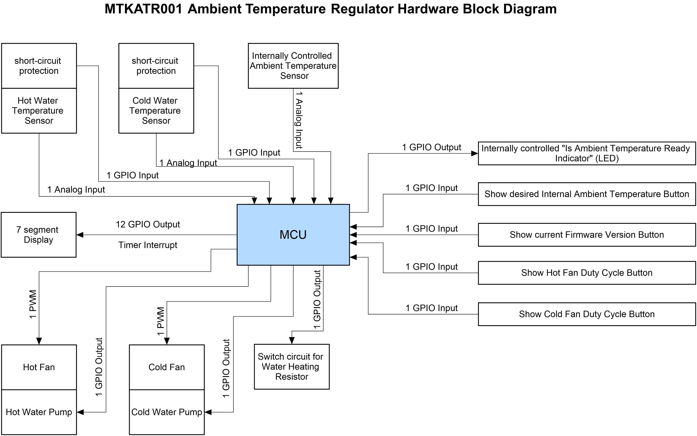

# MTKATR001 Ambient Temperature Regulator Device

Version: 1.0.0.0

This repository contains the all the project files of an Ambient Temperature Regulator System made by César Miranda Meza
that he named as MTKATR001. The main goal of this project was to make a "Proof of Concept Application" of the Protocol
that César Miranda Meza created and named as "<a href=https://github.com/Mortrack/ETX_OTA_Protocol>ETX OTA Protocol</a>"
, which is basically a protocol used in Microcontrollers (MCU) and Microprocessors (MPU) of the STMicroelectronics
family to handle, manage and receive Firmware Updates. Briefly speaking, the template of that protocol that its creator
provided in an open-source project was used here, which gives both a Bootloader Firmware template and an Application
Firmware template. There, the Bootloader Firmware was slightly modified basically to only show a 7-segment display of
the MTKATR001 Device that the device is booting. Aside that, the main application's code was written into the
Application Firmware Template, which also makes use of the ETX OTA Custom Data feature that the ETX OTA Protocol offers
to make data transactions that, while they are meant to be used for delicate data that requires for the MCU/MPU to
always know if the data's integrity was kept intact or not, here it was simply used for non critically important data
and to serve only as a "Proof of Concept Application".

As for the actual application purpose of the MTKATR001 Device, the following image will show how to actual System looks
like before describing its functionalities:

whose block diagram with respect to the things with which its Microcontroller interacts with is the following:

Briefly speaking, the MTKATR001 Device has a sealed interior whose internal ambient temperature is meant to be regulated
by this same Device with respect to a desired temperature with an approximate of +-0.5 celsius degrees of error
tolerance. The temperature to which the user desires to make this Device to regulate towards to, is 25 celsius degrees
by default and can only be changed with an ETX OTA Custom Data Transaction, along with other parameters of this Device.
To see the actual values of some of these parameters, this Device has four buttons next to the 7-segment display that it
has, which is used to show to the user the data corresponding to the button pressed. However, if no button is being
pressed, then this display will show the current celsius degrees of its internal ambient temperature. If this
temperature is within the error tolerance of +-0.5 celsius degrees, only then will the LED that is between the buttons
and the 7-segment display will turn On. If the current internal temperature is not within that error tolerance, then it
will turn Off to indicate to the user to wait for the device to finish regulating its internal ambient temperature. In
addition, this device has two removable water deposits; one at each side as shown in the MTKATR001 Device Image. One of
these deposits has a Water Heating Resistor (the Hot Water Deposit in particular) in it so that the MTKATR001 Device
heats the water up to a user desired point. Whenever the water is not within that point, this Device will inform the
user that the water is going to be heated via the 7-segment display. After reaching the desired Hot Water temperature,
then the MTKATR001 Device will circulate that water to the interior of the upper cavity of the Device, where a 12V-Fan
will be forcing air the pass through the Hot Water tubes before getting into the central interior part of the MTKATR001,
which is where the Internal Ambient temperature is to be regulated. Similarly, the other water deposit (i.e., the Cold
Water deposit) will circulate cold water through some tubes but to the interior of the bottom cavity of the Device where
there is another 12V-Fan that will force air to pass through those cold water tubes before getting inside the central
interior part of the MTKATR001 Device. However, the MTKATR001 Device does not have the capacity to cool the water of the
Cold Water Deposit and, instead, relies on the user for taking care of that part (I, for example, placed ice on the Cold
Water deposit).

On the other hand, know that the same Template Java Application provided in the
<a href=https://github.com/Mortrack/ETX_OTA_Protocol>ETX OTA Protocol Repository</a> was used here unchanged for
applying Bootloader Firmware Updates, Application Firmware Updates and ETX OTA Custom Data Transactions with the
MTKATR001 Device via Bluetooth Low Energy (BLE). This Java Application should look as follows:

but where it is expected for the readers to learn the details of how it works from its documentation.

For more details on how the MTKATR001 works, both the shown Block Diagram and the project files of this repository will
clarify all your questions and doubts. This is because all the available
<a href=https://github.com/Mortrack/MTKATR001_ambient_temperature_regulator/tree/main/hardware/diagrams/circuit_diagrams>Circuit Diagrams</a>
of this system have been well
documentated here and even
<a href=https://github.com/Mortrack/MTKATR001_ambient_temperature_regulator/blob/main/hardware/mathematics/circuit_diagrams_calculations.pdf>the mathematics formulated for the circuits designs</a>
are even made available with explanations. As for
<a href=https://github.com/Mortrack/MTKATR001_ambient_temperature_regulator/tree/main/software/code>all the code of this project</a>
, everything has been explained with the utmost detail with Doxygen
documentation and even a
<a href=https://github.com/Mortrack/MTKATR001_ambient_temperature_regulator/blob/main/software/diagrams/flowchart_diagrams/mtkatr001_ambient_temperature_regulator_flowchart_diagram.png>Flow Chart Diagram of the main logic of the actual application of the MTKATR001 System</a>
has also been provided here.

## How to explore the project files.
The following will describe the general purpose of the folders that are located in the current directory address:

- **/'case_design'**: This folder contains the:
    - A pdf file containing the stickers that were made to place them under each of the four buttons of the MTKATR001 System.
    - The original sketch made for the concept of how the author of this project expected the MTKATR001 System to look like at the end.
    - Some images and videos containing information about:
        - How the MTKATR001 looked like after finishing this project.
        - The electrical power in Watts that the MTKATR001 device consumes (which is about 5.7W whenever the Heating Resistor is turned Off and 790W when it is turned On).
        - The Electrical Power Factor of the MTKATR001 device.
        - Three videos to show the device 1) Regulating at 25 celsius degrees, 2) Receiving an ETX OTA Custom Data Transaction, and 3) Receiving an Application Firmware Update. 
- **/'hardware'**:
    - This folder contains 1) All the Characterizations/modeling that were made for some components of the MTKATR001 device, 2) All the electrical circuit diagrams, and 3) All the mathematics formulated to get to the circuit designs. 
- **/software**:
    - This folder provides the Flowchart Diagram of the actual application code that lies inside the Application Firmware of the MTKATR001 Device, and it also contains all the code used in the MTKATR001 project along with its corresponding documentation.

## Future additions planned for this library

Although I cannot commit to do the following soon, at some point if this project is useful for other people, then I plan
to continue improving the reliability and functionalities of the MTKATR001 System.
